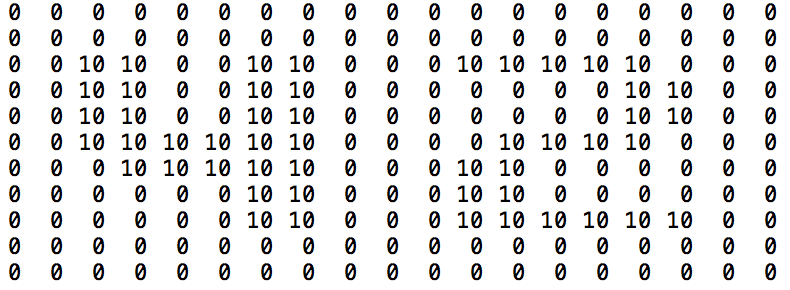
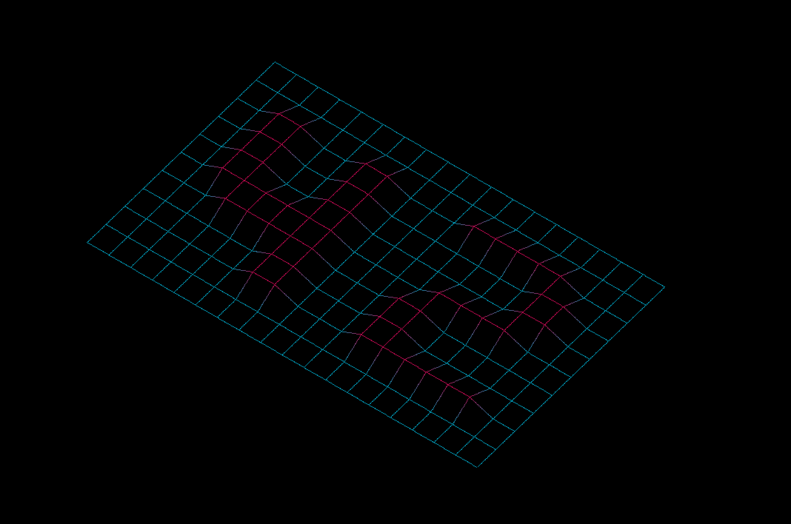
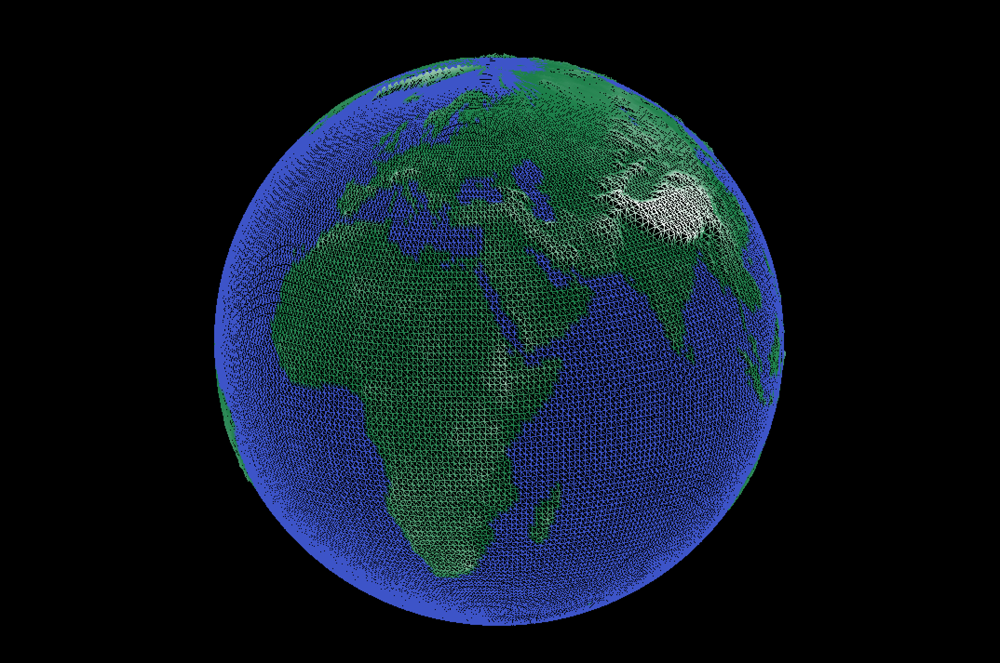
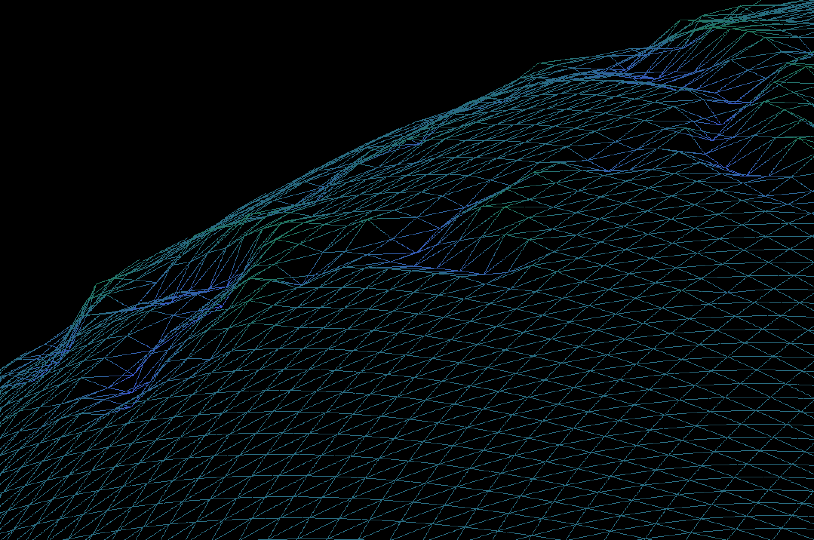
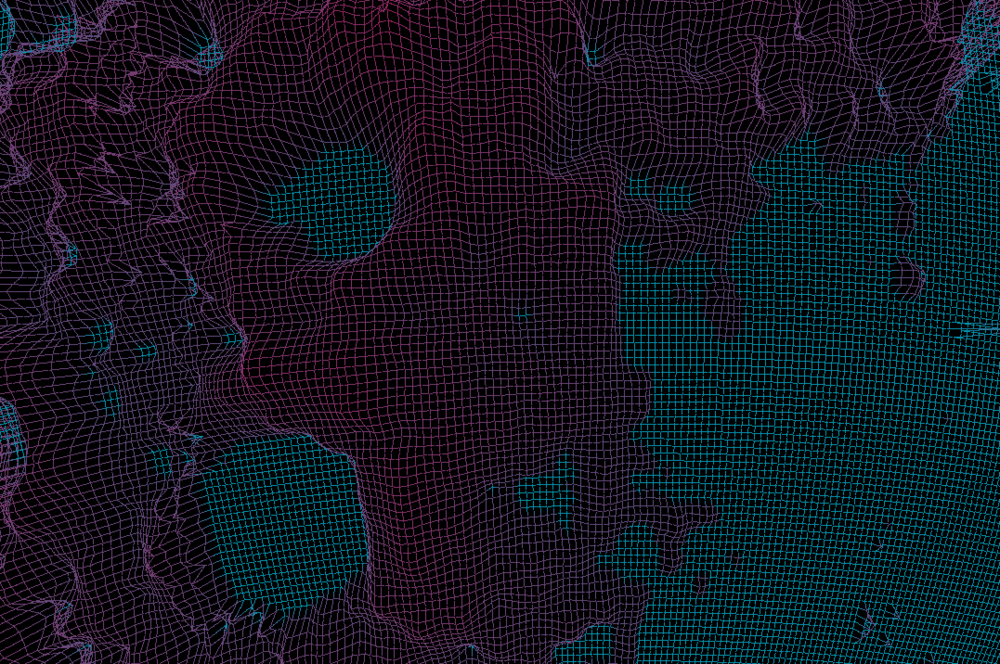
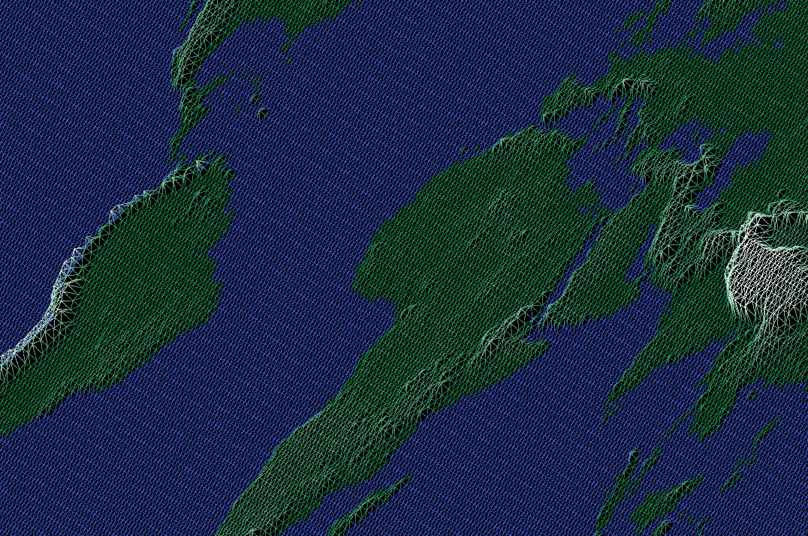

# Fil De Fer

## This project is about representing a landscape as a 3D object in which all surfaces are outlined in lines.
<p align="center">
	
	
	
	
</p>


This is a [42](https://42.fr/en/homepage/) curriculum project. It consists of making wireframe graphics from simple text files. The files are sequences of altitudes to be rendered as a wireframe model.

Here is an example of one those files:


The aim is to turn such a file into an isometric projection, using the school's basic graphics library MiniLibX.



The subject for the assignment can be found [here](subject.pdf).

I decided to go for every bonus, to add spherical projections, colors and bending, in order to make the project more fun.



## Build
To build the project, first clone it and then run `make` in the repository.
```bash
git clone --recursive https://github.com/qu-b/FdF.git
```
```bash
make
```
## Run
```bash
./fdf maps/example_map.fdf
```


## Program Controls

|Key|Action|
|---|---|
|`Up / Down`| Y axis Rotation|
|` Left / Right`| X axis Rotation|
|`< / >`| Z axis Rotation|
|`+ / -`| Zoom |
|`[ / ]`| Altitude Modifier + / -|
|`L`| Diagonals ON /OFF|
|`G`| Spherical view ON /OFF|
|`I`| Isometric view |
|`P`| Parallel view |
|`R`| Reset |
|`A / W / S / D`| Translation |
|`B / V`| Bend + / -|
|`1`| Earth Color Scheme|
|`2`| Black & White Color Scheme|
|`3`| Blue & Yellow Color Scheme|
|`4`| Neon Color Scheme|
|`ESC`|Close and Exit|




## Sources

### MiniLibX Docs
[https://dev.to/freerangepixels/a-probably-terrible-way-to-render-gradients-1p3n](https://dev.to/freerangepixels/a-probably-terrible-way-to-render-gradients-1p3n)

[https://gontjarow.github.io/MiniLibX/](https://gontjarow.github.io/MiniLibX/)

### A Probably Terrible Way to Render Gradients
[https://dev.to/freerangepixels/a-probably-terrible-way-to-render-gradients-1p3n](https://dev.to/freerangepixels/a-probably-terrible-way-to-render-gradients-1p3n)

### Bresenham's line algorithm
[https://en.wikipedia.org/wiki/Bresenham%27s_line_algorithm](https://en.wikipedia.org/wiki/Bresenham%27s_line_algorithm)

### 3D Transformations
[https://www.tutorialspoint.com/computer_graphics/3d_transformation.htm](https://www.tutorialspoint.com/computer_graphics/3d_transformation.htm)

### 3D Computer Graphics
[https://www.tutorialspoint.com/computer_graphics/3d_computer_graphics.htm](https://www.tutorialspoint.com/computer_graphics/3d_computer_graphics.htm)

### Learning Modern 3D Graphics Programming
[https://web.archive.org/web/20150225192611/http://www.arcsynthesis.org/gltut/index.html](https://web.archive.org/web/20150225192611/http://www.arcsynthesis.org/gltut/index.html)